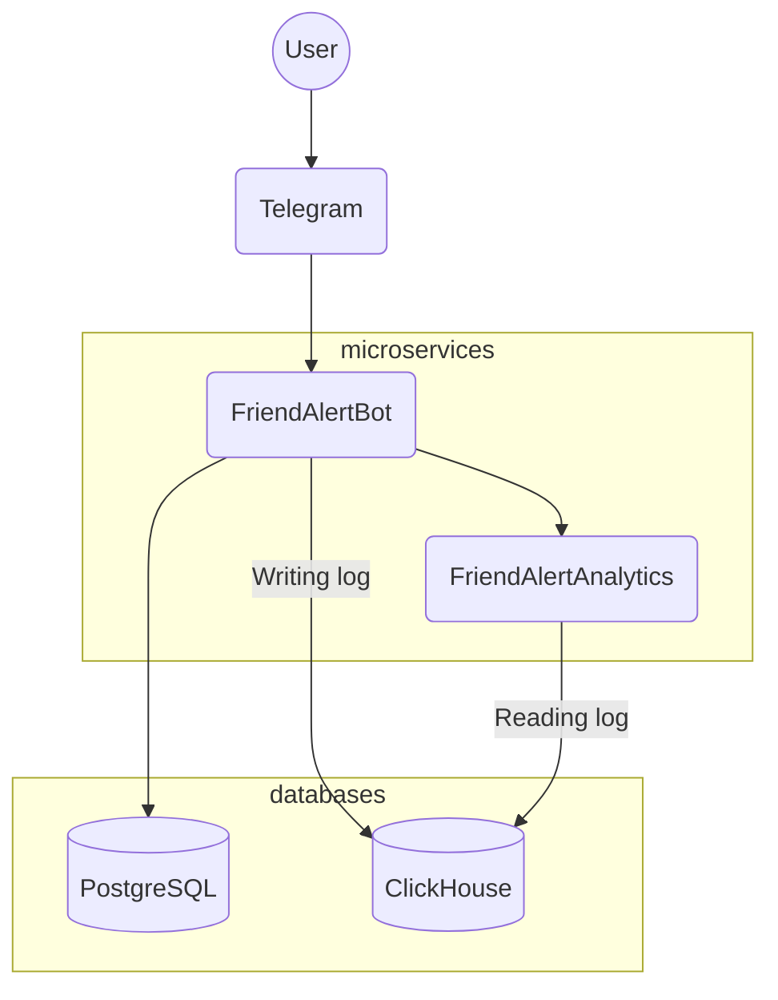
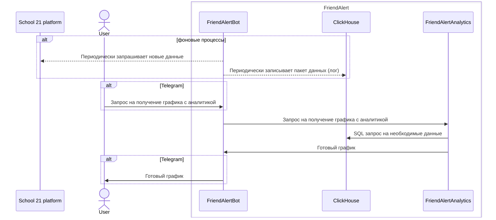

# FriendAlert

### About

Friend Alert is a Telegram bot, made for School 21 students.
It allows users to subscribe for their friends entering and leaving campus.
It also provides extensive statistics on School 21 campuses and participants.

Project includes two microservices:
1. FriendAlertBot (java)
   
    FriendAlertBot gathers data from School 21 platform and sends out messages for users.
    It also logs data for analytics.

2. FriendAlertAnalytics (python)

    FriendAlertAnalytics provides analytics data visualisation

#### Project's flowchart:

#### Project's sequence diagram:

### Databases usage

#### PostgreSQL

Is used as a standard relational data storage.

#### ClickHouse

Is used as a OLAP database for analytics. Tables are written as logs (no deletions, only INSERTs).

### Collected logs

This service collects and logs data for analytics.

participant_info_log:

| Column name | login                         | class_name | parallel_name | exp_value | level | exp_to_next_level | campus    | status                                                               | updated_At          |
|:-----------:|-------------------------------|------------|---------------|-----------|-------|-------------------|-----------|----------------------------------------------------------------------|---------------------|
|  **Type**   | VARCHAR PRIMARY KEY       | VARCHAR    | VARCHAR       | Int32     | Int32 | Int32             | VARCHAR   | VARCHAR 'ACTIVE'/'BLOCKED'/ /'EXPELLED'/'TEMPORARY_BLOCKING' | TIMESTAMP           |
| **Example** | fondaata@student.21-school.ru | 23_04_MSK  | Core program  | 12310     | 10    | 1189              | 21 Moscow | ACTIVE                                                               | 2024-07-08 19:59:43 |

visitors_count_log:

| Column name | timestamp                 | campus                  | cluster                 | visitors_count |
|:-----------:|---------------------------|-------------------------|-------------------------|----------------|
|  **Type**   | TIMESTAMP PRIMARY KEY | VARCHAR PRIMARY KEY | VARCHAR PRIMARY KEY | Int32          |
| **Example** | 2024-07-06 17:29:44       | 21 Moscow               | Atlantis                | 15             |

visitors_transit_log:

| Column name | timestamp                 | campus    | cluster | place   | login                         | direction                        |
|:-----------:|---------------------------|-----------|---------|---------|-------------------------------|----------------------------------|
|  **Type**   | TIMESTAMP PRIMARY KEY | VARCHAR   | VARCHAR | VARCHAR | VARCHAR TIMESTAMP         | VARCHAR 'ENTERING'/'LEAVING' |
| **Example** | 2024-07-08 14:01:01       | 21 Moscow | Mirage  | a3      | fondaata@student.21-school.ru | ENTERING                         |
