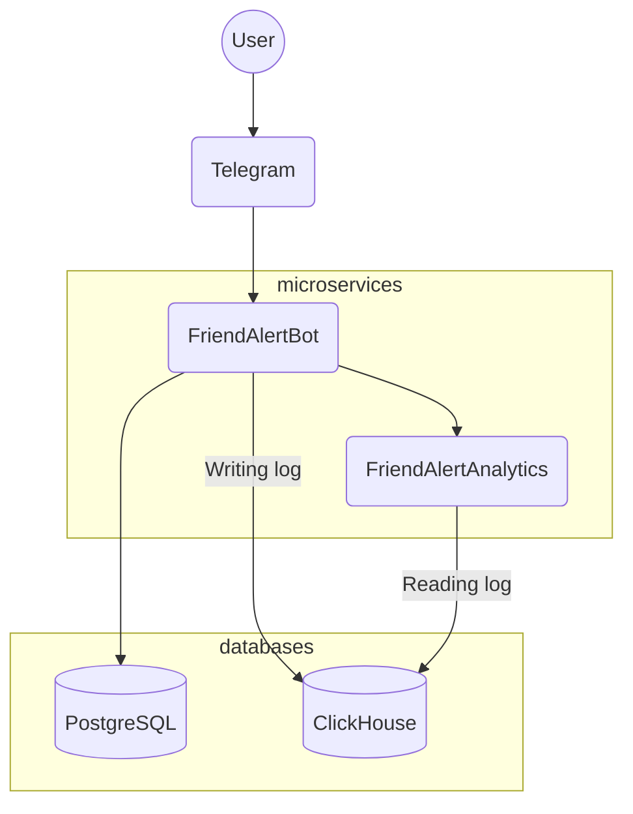
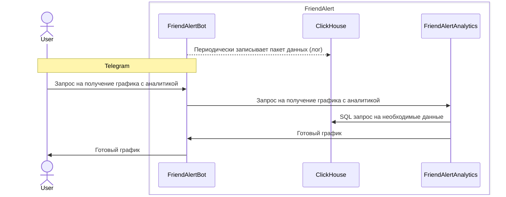

# FriendAlert

### About

Friend Alert is a Telegram bot, made for School 21 students.
It allows users to subscribe for their friends entering and leaving campus.
It also provides extensive statistics on School 21 campuses and participants.

Project includes two microservices:
1. FriendAlertBot (java)
   
    FriendAlertBot gathers data from School 21 platform and sends out messages for users.
    It also logs data for analytics.

2. FriendAlertAnalytics (python)

    FriendAlertAnalytics provides analytics data visualisation

#### Project's flowchart:

#### Project's sequence diagram:

